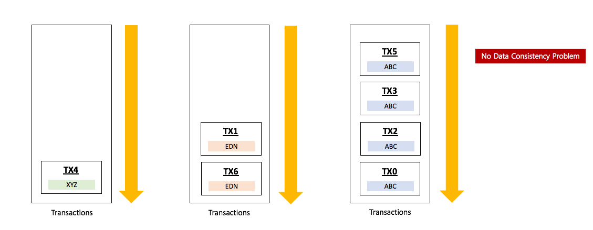
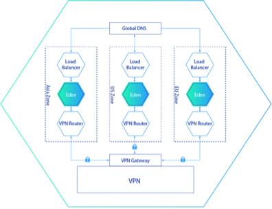
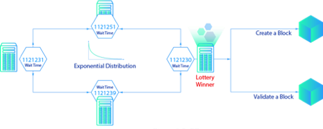
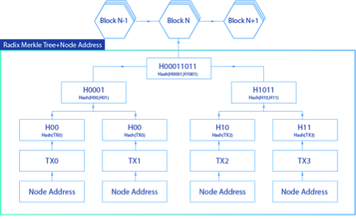
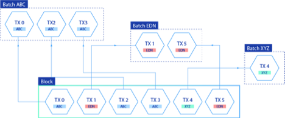

.. container::
   :name: page

   .. container:: aui-page-panel
      :name: main

      .. container::
         :name: main-header

         .. container::
            :name: breadcrumb-section

            #. `Eden Platform <index.html>`__
            #. `EdenChain Doc <EdenChain-Doc_120848728.html>`__

         .. rubric:: EdenChain Introduction
            :name: title-heading
            :class: pagetitle

      .. container:: view
         :name: content

         .. container:: page-metadata

            Created by James Ahn, last modified by Hailee Kim on Mar 26,
            2019

         .. container:: wiki-content group
            :name: main-content

            
Overview
==========

Eden is a blockchain-based programmable economy platform
that provides high-performance processing speeds which
address the aforementioned technical issues. Eden has the
capacity to develop a variety of automated services using
smart contracts, enabling interoperability with external
systems. The core technologies implementing programmable
economy smart contracts, have a greater technological and
economic value than non-deterministic smart contracts that
require off-chain integration rather than deterministic
smart contracts that are operated only on-chain.

Conventional blockchain technologies such as Bitcoin and
Ethereum are unsafe because they are exposed to hacker
attacks. This is due to the lack of guaranteed trust in
interacting with external systems that are normally required
for non-deterministic smart contracts. Eden uses the
E-Bridge layer to retrieve data from multiple data sources
when a non-deterministic smart contract is interfaced with
an external system. Eden encrypts this data and incorporates
the Median Voter Theorem (MVT) to secure trust and to defend
against attacks from hackers.

Performance is a vital technical issue that is essential to
the implementation of smart contracts. Eden combines
namespaces with Merkle Tree, isolates transactions based on
its particular namespace, and secures performance and
scalability by constructing an execution system capable of
parallel processing by namespace. This enables the ability
to carry out a vast number of transactions simultaneously in
parallel.

Eden supports Solidity, the most popular smart contract
language at this time, as well as Dyerium's EVM since smart
contracts are heavily used for sensitive services such as
payment and settlement. Stable and reliable smart contract
programming languages are more important than the creation
of an unnecessary new type of programming language.  The
emergence of a new type of language that requires a long
time to be validated through constant testing and can be
exposed to serious security vulnerabilities during this
validation period. Eden constructs a blockchain using EVM
and Solidity, which are verified and continually improved by
the community.

Since Eden guarantees secured connectivity, one can fully
realize a programmable economy by trading various
blockchain-based assets on the Internet. Tokenization of any
type of asset can publicly prove ownership of the asset and
the owner of a particular asset can take part in both P2P
transactions and transactions on exchanges.

Permissioned Blockchain
========================

A permissioned blockchain has evolved as an alternative to
permissionless blockchain technology, which allows anyone to
join a network, such as Bitcoin and Ethereum. Permissioned
blockchain technology must be authorized by a network
administrator through an authentication process in order to
participate in the network.

Newly emerging blockchain technologies such as Kadena,
Tendermint, and Chain, adopted permissioned networks, and
Hyperledger, a blockchain open source project for the Linux
Foundation, also adopted the permissioned blockchain
technology. Eden is configured with a permissioned
blockchain to run smart contracts quickly and efficiently in
a trusted environment.

In a permissionless blockchain network such as Ethereum, a
smart contract runs on all nodes. This leads to significant
problems surrounding performance and efficiency. All smart
contracts are stored in an EVM within a blockchain network
and are executed according to certain conditions. If a
million, or a hundred million, smart contracts exist in an
Ethereum blockchain, serious performance problems may occur.
Miners within the network may prioritize running smart
contracts from which they can gain higher profits, that is,
those with higher gas, so all smart contracts may not be
executed. Although individually running smart contracts on
all full nodes are based on the philosophy of the
permissionless blockchain technology, individually running
and validating the smart contracts on all of the nodes at
all times is not considered efficient.

Eden is a permissioned blockchain that builds and runs a
trustworthy environment for smart contract execution. This
is achieved with the use of a platform that not only ensures
safety but also increases efficiency through the use of
nodes within namespaces which helps guarantee 100 percent
processing of all transactions.

Design Principle
===================

The design principle is important especially when it comes
to platform software because the principle resolves conflict
among many software modules as well as giving guideline to
keep architectual consistency.

The technical problems edenchain wants to deal with are 3
items.

#. To provide scalable blockchain platform where required
    performance will be delivered with ease
#. To guarantee non-stop blockchain platform to its users 
#. To accelerate blockchain business service 

So the selected design principle is supposed to meet those
requirements. Scalability, High-Availability and
Accessibility are 3 design principles adopted in Edenchain
architecture.

Scalability
------------------

As we know, scalability means that increasing or decreasing
capacity of processing power to handle received tasks.
Scalability is the top priority demanded by most of
blockchain services since existing blockchain platforms are
not suitable to process real world workload. Basically there
are 2 options to smooth scalability, scale up and scale out.
Edenchain achieves the scalability through scale out.

The basic idea for the scale out is doing parallel
processing in distributed manner. Handling massive workload
simultaneously needs to have multiple computing resources
which can digest its given workload in distributed
environment. So scalability design principle forces to have
a design which allows workload distribution by algorithm,
data structure and so on.

Accessibility
-----------------

Accessibility takes important position when it comes to
blockchain service implementation. What if the technology
which solves blockchain's major tech problems is not easy to
learn, and hard to find right developers. 

The blockchain platform should be easy to use and learn, not
hard to find developers for fast pervasiveness even though
architecture should sacrificing flexibility and
functionality. 

In Edenchain, accessibility is the second important design
principle to fulfill its vision, permissioned blockchain
platform for enterprises.

High Availability
-------------------

Since Eden is a permissioned blockchain, a consideration of
service availability is necessary. Given that an Eden server
is operated by a small number of authorized agencies or
companies, the server operation can be terminated when many
hackers attack the servers or when there is a natural
disaster such as an earthquake. Eden must be able to
guarantee high availability in order to ensure that the
services for users and businesses alike can continue to
operate at all times regardless of any external threat.

Eden utilizes cloud services to ensure a high degree of
availability and operates an Eden system with a
multi-datacenter pattern using a global DNS and a load
balancer. The same system that provides the Eden service is
configured and operated in each service zone across major
continents such as Asia, North America, and Europe, and it
can provide a stable service despite attacks from hackers
and or the occurrence of natural disasters.

A network between service zones deployed on each of the
continents is composed of a Virtual Private Network (VPN).
Cloud services provide connectivity between data centers
across continents with high-speed dedicated lines, enabling
fast networking and a data center-to-data center
configuration. A multi-datacenter pattern is a pattern
provided by the cloud service provider Amazon. It is used by
a number of Internet companies such as the Apache
Foundation, Netflix, CloudFoundry, and Attlasian, and is
also recommended by Microsoft Azure.

*The above image shows a configuration of an operating
environment of Eden to which a multi data center pattern and
a VPN are applied. The operating environment receives a data
request from outside a global DNS, plays the role of being
connected to an appropriate service zone, and secures
availability by operating multiple global DNS servers.
Endpoints of all services are designed and operated so as to
be the global DNS. A load balancer delivers requests
forwarded from the global DNS to Eden servers in order to be
processed. The load balancer not only requests routing but
also collects status information from each of the servers.
This helps perform a more intelligent service operation than
a round-robin service operation, which in turn allows the
system to pinpoint servers that encounter a problem and to
monitor the workload on each server, thereby aiding in
capacity planning.*

Servers running Eden are protected by an operational
firewall. The operational firewall is a way to organize the
Eden servers into functional groups and to apply a firewall
policy to each of the organized functional groups. The
operational firewall can functionally apply a
well-abstracted security policy to a server so that a
security policy can be flexibly designed, applied to each of
the groups, and managed internally.  This allows the Eden
architecture to minimize any form of potential mistake in
setting work by users.

If a VPN in full mesh topology is built between service
zones, performance and management problems will arise
because each VPN configuration becomes more complicated as
the range of the service zone increases. The Eden operating
system can configure a VPN in a star topology so that a VPN
router in a service zone can be connected with a VPN gateway
without connecting to all of the service zones and enable
VPN networking with the other service zones.

Consensus Algorithm
========================

POET
------

The consensus algorithm plays an important role in a
blockchain technique. There are two approaches. The first is
"Nakamoto Consensus," which is a way to conduct a leader
selection through a lottery process. When selected as a
leader, one has the right to authenticate a previous block
and to create a new block. In case of Bitcoin, a node that
solves a hash puzzle first is selected as the leader. The
second method uses "BFT (Byzantine Fault Tolerance)." This
method does not select a leader and a final agreement is
reached through several stages of voting.

Eden uses Proof-of-Elapsed-Time (PoET) as a consensus
algorithm. PoET is a "Nakamoto Consensus" method, which uses
a CPU command to select a leader randomly without using
enormous levels of energy to solve a hash problem like
Bitcoin currently does. PoET provides an opportunity to
become a leader with block generation authority for all
nodes participating in a blockchain network with a
probability similar to of other leader selection algorithms
(Foundation, 2017). PoET is implemented in an SGX enclave so
as to defend against hacker attacks and to allow the leader
selection process to proceed safely. At each node, PoET uses
a CPU command in the SGX enclave to obtain a wait time that
follows an exponential distribution as a random number and
selects the node that has the smallest wait time as the
leader.

PoET is designed to follow the Poisson distribution, which
is a form of discrete probability distribution that follows
the exponential distribution shown below and expresses how
many times a certain number of events occur within a unit
time if the event is independent.

Namespace
===============

Eden uses a Radix Merkle Tree to store a current state of
the blockchain. Validator nodes that check conformity of
blocks all contain Radix Merkle Tree. Radix Merkle Tree
displays some data with optimal space. If there is only one
child node, it unites the nodes into one, so it can
effectively use memory.

In a leaf node of the Radix Merkle Tree, a node address is
included, and thus it is possible to identify a sibling or a
parent of the node by the node address value. A validator
node examines a node address included in a transaction
within a block and a batch to verify the transaction.

Node Address = Namespace + Node Path

A namespace is a form of identification value for
ascertaining the type of transaction and all transactions in
Eden must contain namespace information. Validator nodes can
use the namespace information to group transactions into
blocks of related transactions. For example, for a
transaction that contains simple transactional information,
the namespace "EDN" is used, and for smart contract XYZ, a
namespace "XYZ" is used. The validator node can distinguish
XYZ-related transactions from EDN-related transactions by
simply checking a namespace contained in the transaction.
Since EDN and XYZ are different types of transactions there
is no data consistency problem and both transactions can be
executed in parallel. As a result, it is no longer necessary
to execute one transaction at a time due to data consistency
issues as is the case for many existing solutions in the
blockchain space.

REST API
==========

REST API is core part of Edenchain to let developer build
blockchain business application quickly and easily.

REST API is the tool to realize the design principle,
accessibility. REST API is well known in software and
furthermore it is defacto standard for any kinds of
integration. 

Edenchain enables developer create blockchain business
application by using REST API only. Developer is not
supposed to have deep knowledge in blockchain nor Edenchain
as long as developer knows how to use REST API. Edenchain
aims to provide intuitive REST API to developer, so less
than half day, developer can start service implementation by
reading API documents and sample codes.

   .. container::
      :name: footer

      .. container:: section footer-body

         Document generated by Confluence on Mar 28, 2019 12:30

         .. container::
            :name: footer-logo

            `Atlassian <http://www.atlassian.com/>`__

.. |image0| image:: images/icons/bullet_blue.gif
   :width: 8px
   :height: 8px
.. |image1| image:: images/icons/bullet_blue.gif
   :width: 8px
   :height: 8px
.. |image2| image:: images/icons/bullet_blue.gif
   :width: 8px
   :height: 8px
.. |image3| image:: images/icons/bullet_blue.gif
   :width: 8px
   :height: 8px
.. |image4| image:: images/icons/bullet_blue.gif
   :width: 8px
   :height: 8px

