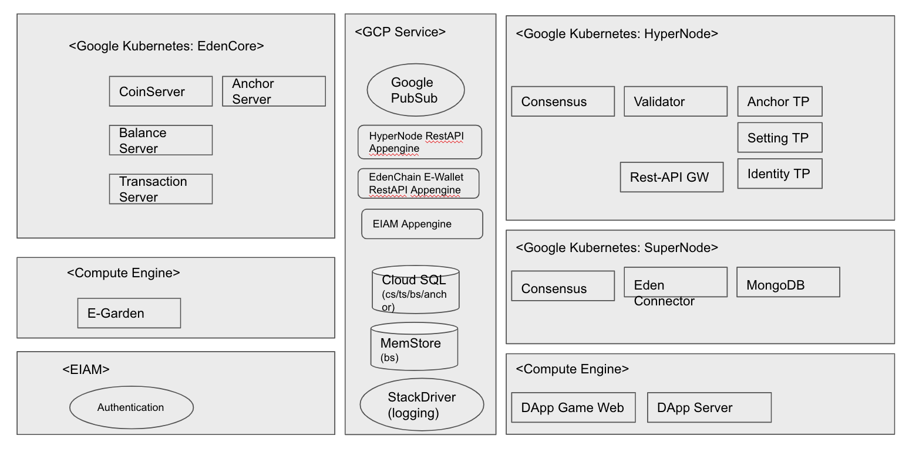

Core Components
===============

Edenchain is composed of several core components. So it is a good step
to browse core components to have a good understanding on Edenchain.

The below image tells core components, relationship and how it is
deployed.

Edenchain is a cloud based blockchain platform, as you can see heavy
usage of kubernates, hyper node, super node and eden core are running on
top of kubernates.

Edencore modules are handling essential business logic required to
operate Edenchain, pure blockchain related functions are located in
hyper node and super node.

Hyper node manages EDN coin, TEDN coin and anchoring. It is the main
blockchain in Edenchain.

Super node is solely dedicated to process requests from corresponding
dApp. dApp is not allowed to access hyper node directly, it accesses
super node to process its task. Then depending on requests, core
component deals with it.

dApp server, dApp client are supposed to be created by dApp provider.
dApp server connects super node to handle corresponding tasks submitted
from dApp client. 

Component List
--------------

Hyper Node
~~~~~~~~~~

Hyper node has 3 major tasks. 

-  Native Coin, EDN Management

-  TEDN Anchoring

-  Super Node Transaction Data Anchoring

Super Node
~~~~~~~~~~

Super node handles dApp's request, more precisely it stores TEDN related
transactions generated by dApp.

It is primary tasks is to record TEDN transactions in its storage. 

-  To record TEDN related transactions 

Coin Server
~~~~~~~~~~~

Edenchain has internally 2 types of coin, EDN(native coin),
TEDN(internal coin for dApp). TEDN is the main coin required to use
dApp. 

Coin server exchanges EDN to TEDN, TEDN to EDN, it acts like an internal
exchange server in Edenchain. 

-  Convert EDN to TEDN

-  Convert TEDN to EDN

Balance Server
~~~~~~~~~~~~~~

Balance server processes actual coin related transactions such as
deposit/withdraw but it is dedicated for TEDN.

It has a sophisticated logic to manage TEDN correctly to secure those
transactions between dApp client and dApp server. Because it could have
many unexpected situations such as hacking, double spending, system
error and so on. In any cases, balance of TEDN should not be manipulated
and there should be no errors.

-  To handle deposit/withdraw TEDN

Transaction Server
~~~~~~~~~~~~~~~~~~

Transaction Server is the middleware of all super-node transactions.

When writing transaction is transmitted, Transaction server will
validate the transaction and write it to super node.

and super node completes block commit, transaction server will be
notified the completed events, get the block which completed and write
it to data storage.

If there is request for reading transaction blocks, it returns from data
storage like read cache. 

Transaction server does block height/transaction anchoring.

-  TEDN Transaction Cache

-  To write transactions in super node

-  To read transaction from cache

-  To write anchoring data into hyper node

EIAM
~~~~

EIAM is an identity server in Edenchain platform. IAM plays important
role because it provides identity information to requester.

EIAM has account info, user specific information and so on in encrypted
manner to secure data. 

For higher security, EIAM supports 2 types of user, normal user and
server user. Normal user has limited accessibility bounded for connected
user's data only. 

Server user has full accessibility, server user is created and granted
by Edenchain's admin. Server user uses TLS.

-  Identity Management

-  To send identity information to requester

-  To sign TEDN transaction

-  To create TEDN wallet address

dApp Server
~~~~~~~~~~~

dApp server handles requests from dApp client with its own business
logic.

In development viewpoint, dApp server has 2 major roles, 1) business
logic, 2) access to super node.

For security reason, dApp client is not supposed to access super node
directly. We expects HTML5 will be a major technology for dApp building.
HTML5 is a easy to use, cross platform with good eco system, but 
relatively easy to hack and there are many hacking tools available. So
blockchain related processing is under dApp server's functionality. 

-  To manage TEDN

-  Business logics

-  TEDN balance check

-  Sign in/Sign out

.. |C:\4e804d4eb65b4c7840959473dcf77351| image:: media/image1.tmp
   :width: 4.875in
   :height: 2.40625in
