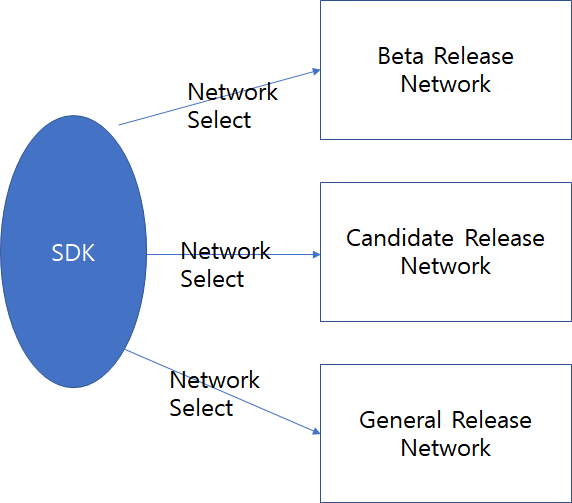

Overview
--------

에덴체인 SDK는 블럭체인 개발자가 에덴체인을 쉽게 사용할 수 있도록
제공하는 라이브러리이다.

Client에서 사용하기 위해서 JavaScript, Python의 형태로 제공한다.

에덴체인 SDK는 현재 사용자 단의 인터페이스만 제공하고 있으며,  블럭체인
계정 생성 및 접근과 필요한 인터페이스를 간단하게 사용할 수 있도록
제공하고 있다.

현 문서에서는 SDK를 위한 환경 설정과 샘플 프로그램에 대한 설명을 하고
있으며, 제공하는 SDK refererence guide를 제공한다.

구조
----

SDK는 Javascript는 npm으로 제공되고, Python은 Pip를 통해 설치될 수
있도록 제공된다. 

추후 다른 언어도 지원하도록 할 예정이다.

에덴체인 네트워크는 Beta Release, Candidate Release, General Release의
3개가 제공될 예정이며, 현재 배포하는 SDK에서는 Beta Release를 위한
인터페이스를 제공한다.

사실 내부적으로는 모두 동일한 인터페이스를 제공하고 있으나 SDK의 설정을
통해 쉽게 네트워크를 변경할 수 있다.

다른 네트워크의 선택은 각 스케줄에 맞추어 업데이트 될 예정이며, SDK는 각
배포시 네트워크에 맞는 추가 기능을 넣어 배포할 예정이다.

SDK의 버전마다 지원할 버전이 틀리므로, 개발자는 주의하여 사용하도록
한다.

버전 정보
---------
   ::

      0.4.x 이하     →    Beta Release Network 지원 버전
      0.5.0 부터    →    Candidate Release Network 지원 버전
      1.x.x. 이상    → General Release Network 지원 버전

개발 환경 정보
--------------

1. Javascript
   ::

      Node v10 이상
      Npm v6.9 이상
      지원 Platform : Windows, MacOS, Linux

2. Python
   ::

      Python3 지원
      지원 Platform: Windows, MacOS, Linux 

Beta Release SDK에서 제공하는 기능
----------------------------------
   ::

      Edenchain Sign Up하여 Wallet 생성
      Edenchain Sign In하여 Wallet Access
      Edenchain 잔액 얻기
      Edenchain 사용자 정보 얻기
      Edenchain 자신의 트랜잭션 정보 얻기
      Edenchain 의 자신의 계정에 Ethereum 주소 넣기
      Edechain의 자신의 계정이 Ethereum 주소 삭제
      EdenChain에 기존 Ethereum ERC20 EDN Token Deposit
      EdenChain에서 Ethereum ERC20 EDN Token으로 Withdraw

해당 기능을 우선 제공하도록 하며, Candidate Release에 맞추어 더 많은 기능을 제공할 예정이다.

