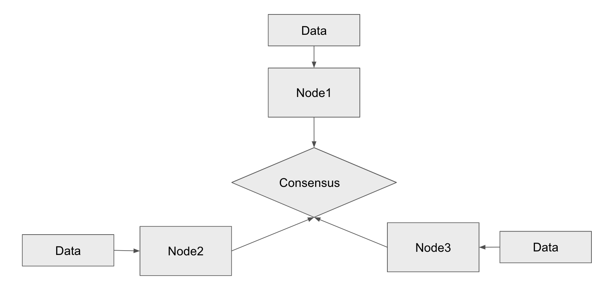

Super Node
==========

Super Node is a dedicated blockchain network for specific dApp. So you
may regard super node ad dApp blockchain network.

From enterprise's viewpoint, dApp is business itself, interacting with
customers, selling its service. So enterprise wants to have full
controllability as well as governance.

Super node is being introduced to support enterprise's need. It is
independent from hyper node with separated computing zone. In short,
super node is a complete blockchain belong to Edenchain.

So super node has its own consensus algorithm and data storage.  The
below image shows architecture of super node.

Each node has full data and if there is a new transaction data, it
checks transaction and does consensus to verify legitimacy of the
transaction. If majority nodes accept the transaction through consensus
mechanism, the data will be written in data storage. It sounds like how
general blockchain works. The most big difference between general
blockchain and super node is placed in simplicity.

What it does means that one of the critical value of super node comes
from performance, super node is supposed to process dApp's request with
minimum delay to give similliar user experience like common app.

So super node has mandatory modules to fulfill its core functions. Super
node is independents from hyper nodes, regardless of hyper node's
availability, it can work seamlessly. 

